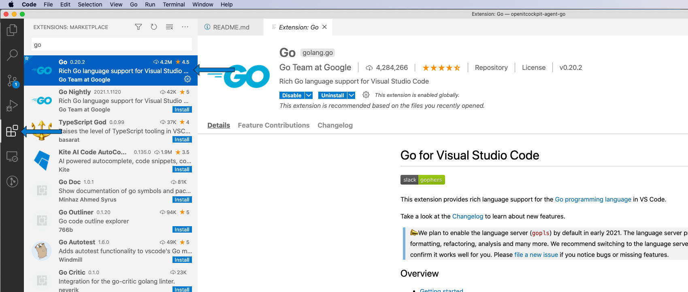
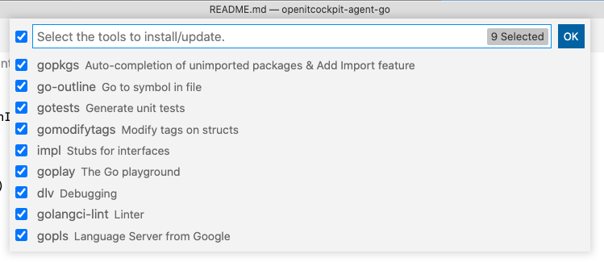

# openITCOCKPIT Monitoring Agent 3.0
Cross-Platform Monitoring Agent for openITCOCKPIT written in Go

1. [Installation](#Installation)
2. [Requirements](#Requirements)
3. [Usage](#Usage)
4. [Join Development](#Join-Development)

## Requirements

- Windows Server 2012 or newer
- Windows 8 or newer
- macOS 10.14 Mojave or newer
- Linux

## Join Development

Do you want to modify the source code of the openITCOCKPIT Monitoring Agent? If yes follow this guide to getting started. 

Please make sure you have install [Golang](https://golang.org/) >= 1.15.6 and [Visual Studio Code](https://code.visualstudio.com/) installed.

1. Clone this repository
```
git clone https://github.com/it-novum/openitcockpit-agent.git
```

2. Run Visual Studio Code and make sure that you have installed the [Go extension](https://marketplace.visualstudio.com/items?itemName=golang.Go)


3. Install Go tools
Press `ctrl` + `shift` + `P` (Windows and Linux) or `cmd` + `shift` + `P` on macOS and select `Go: Install/Update Tools`


Select all tools and confirm with `Ok`


The installation is completed, as soon as you see `All tools successfully installed. You are ready to Go :).` in the VS Code terminal

4. Setup VS Code
Press `ctrl` + `shift` + `P` (Windows and Linux) or `cmd` + `shift` + `P` on macOS and type `settings json` and select `Preferences: Open Settings (JSON)`.
Add the following settings to your JSON.
```JS
    "go.testTimeout": "90s",
    "go.useLanguageServer": true,
    
    // Remove this if you do NOT want to enable libvirt
    "go.toolsEnvVars": {
        "GOFLAGS": "-tags=libvirt"
    },
    "go.lintTool": "golangci-lint",
    "[go]": {
        "editor.formatOnSave": true,
        "editor.codeActionsOnSave": {
            "source.organizeImports": true,
        },
        // Optional: Disable snippets, as they conflict with completion ranking.
        "editor.snippetSuggestions": "none",
    },
    "[go.mod]": {
        "editor.formatOnSave": true,
        "editor.codeActionsOnSave": {
            "source.organizeImports": true,
        },
    },
    "gopls": {
        // Add parameter placeholders when completing a function.
        "usePlaceholders": true,

        // If true, enable additional analyses with staticcheck.
        // Warning: This will significantly increase memory usage.
        "staticcheck": false,
    }
```
> Source: https://github.com/golang/tools/blob/master/gopls/doc/vscode.md

5. Debug Launch Configuration

Run -> Open Configurations
```JS
{
    // Use IntelliSense to learn about possible attributes.
    // Hover to view descriptions of existing attributes.
    // For more information, visit: https://go.microsoft.com/fwlink/?linkid=830387
    "version": "0.2.0",
    "configurations": [
        {
            "name": "Launch",
            "type": "go",
            "request": "launch",
            "mode": "auto",
            "program": "${workspaceFolder}",
            "env": {
                "OITC_AGENT_DEBUG": "1",
            },
            "args": ["-c", ".\\config.cnf", "--disable-logfile", "--debug"]
        }
    ]
}
```

Create a new file in workspace folder -> "config.cnf"
```ini
[default]
customchecks = ./customchecks.cnf
```

Create a new file in workspace folder -> "customchecks.cnf" (Windows)

```ini
[check_Windows_Services_Status_OSS]
command = echo 'hello world'
interval = 15
timeout = 10
enabled = false
```

Create a new file in workspace folder -> "customchecks.cnf" (Linux/Mac)

```ini
[check_echo]
command = echo 'hello world'
interval = 15
timeout = 10
enabled = false
```

## Windows development notes

By default the agent will assume to be run as Windows Service. If you set OITC_AGENT_DEBUG it will run the default cmd like on linux.

## Build binary
### Static linked (recommended)
```
CGO_ENABLED=0 go build -o agent main.go
``` 

### Enable libvirt support

Required libvirt-dev

```
go build -o agent -tags libvirt main.go
```

check with `ldd agent` 

### Cross compile

#### 32 Bit
```
CGO_ENABLED=0 GOARCH=386 go build -o agent main.go
```

#### Arm64
```
CGO_ENABLED=0 GOARCH=arm64 go build -o agent main.go
```

#### Build darwin on Linux
```
CGO_ENABLED=0 GOOS=darwin GOARCH=amd64 go build -o agent main.go
```

Start hacking :)

## Windows Service Configuration

Several settings can't be configured via config.cnf but as a CLI parameter. On Windows we run the agent usually as a service. You can set the following parameters via the Windows Registry.

Path: HKEY_LOCAL_MACHINE\SOFTWARE\it-novum\InstalledProducts\openitcockpit-agent

There you can add the following additional configuration keys. All keys must be of type string, even when they are numbers!

| Key | Default | Possible|
| ----|---------| --------|
| InstallLocation |  | Never change this |
| ConfigurationPath | InstallLocation/config.cnf | Any valid path |
| LogPath | InstallLocation/agent.log | Any valid path |
| LogRotate | 3 | 0 - N (0 == disable) |
| Verbose | 0 | 0 - 1 |
| Debug | 0 | 0 -1 |

## Windows ARM Support

Windows ARM devices have to use 386 Version for now. Several libraries we're depending on require changes.

* github.com/go-ole/go-ole
* github.com/shirou/gopsutil/v3

We could also do this, as the changes should be minor, but we don't have any test devices for this right now.

## Webserver API

### Endpoints

#### GET /

Check results in json format. The result could be {} if the checks did not finish correctly or couldn't be serialized.

#### GET /config

If config push mode is enabled it will return the following JSON

```json
{
    "configuration": "base64 string of the configuration file",
    "customcheck_configuration": "base64 string of the custom check configuration file or empty string if it does not exist"
}
```

#### POST /config

Expects a JSON with the same format of GET /config

The base64 will be decoded and written to the current configuration paths.

#### GET /autotls

Returns a certificate request for Auto-TLS. This will generate a new private key if there's none.

```json
{
    "csr": "contents of the CSR in PEM format"
}
```

#### POST /autotls

Stores a new ssl certificate and CA certificate for Auto-TLS.

```json
{
    "signed": "",
    "ca": ""
}
```

### Auto-TLS

After Auto-TLS has been established further certificate updates are only possible from the OITC server, because it is then required to use a valid https connection. You can also enable basic auth if you want additional security for the first "handshake".

## Notes
- https://github.com/kata-containers/govmm
- https://github.com/digitalocean/go-qemu
- https://github.com/cha87de/kvmtop
- https://github.com/0xef53/go-qmp
- https://github.com/0xef53/kvmrun
